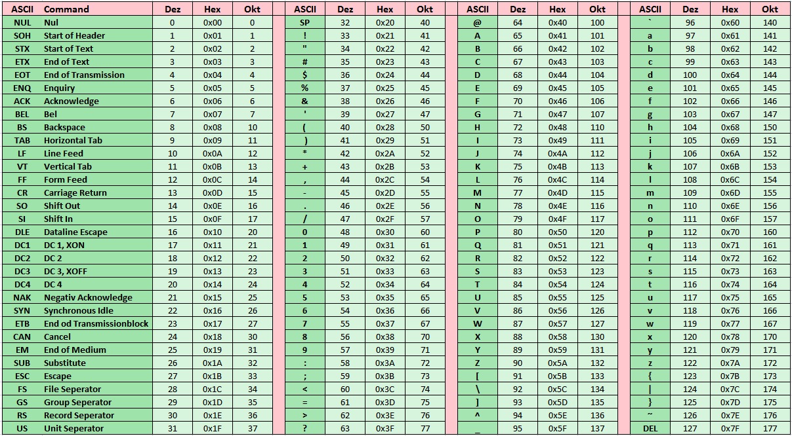

# ASCII

## Einführung

ASCII steht für **American Standard Code for Information Interchange**. Der ASCII-Code stammt ursprünglich aus den 1960er Jahren und definierte eine 7-Bit Zeichenkodierung. Zu den 128 Zeichen gehören 33 nicht druckbare, sogenannte Steuerzeichen und 95 druckbare Zeichen. Der ASCII Zeichensatz umfasst die Zeichen (inkl. Steuerzeichen des amerikanischen Tastaturlayouts). Er beinhaltet auch Steuerzeichen die von der Schreibmaschine stammen. Beispiele dafür sind `Carriage Return` oder `Line Feed` und sogar die Glocke (Bell) wurde ein Zeichen reserviert. Der ASCII Code diente als Grundlage zahlreiche weitere Codes und Zeichensätze. Diese haben sich dabei vor allem in den hinteren 128 Zeichen (das 8te Bit) unterschieden.

## Kodierung

Jedes der 128 Zeichen ist einem Bitmuster und damit einem Wert zugeordnet. Das erste Zeichen beginnt bei 0, das letzte hat den Wert 127. Das 8te Bit ist jeweils Null gesetzt und kommt nur in erweiterten Zeichensätzen zur Anwendung.

## Verwendung

Zu Beginn der Computer-Entwicklung wurde ASCII zum Standard-Zeichensatz. Auch Peripheriegeräte wie Drucker basierten darauf.
Es wird heute noch in vielen Schnittstellen insbesondere von Industrieanwendungen verwendet  (z.B. Barcode-Scanner, einfache Steuerungen etc.).
Der ASCII Code ist bis heute einer der einfachsten Wege über eine Serielle Schnittstelle eines z.B. Mikrocontrollers und einem PC (Terminal Programm) zu kommunizieren.

## Aufgabenstellung

